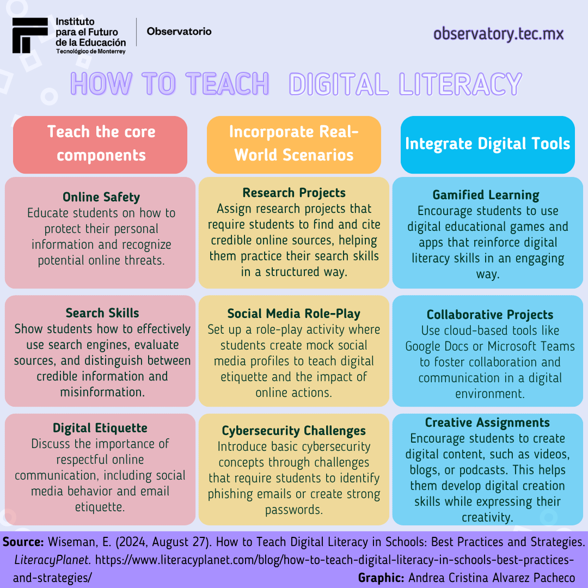

# Seminario: El Lado Oscuro de la Seguridad de la Información

*Imagen: Representación visual de la Tríada CIA (Confidencialidad, Integridad, Disponibilidad) - Fundamentos de la ciberseguridad*

## Módulo 1: Ciberseguridad en el Entorno Educativo y Familiar

### Introducción

El presente documento aborda en profundidad los contenidos del Módulo 3 del seminario "El lado oculto de la Seguridad de la Información", diseñado para docentes universitarios y alumnos de Gendarmería Nacional. Este módulo se centra en la ciberseguridad desde sus fundamentos hasta su aplicación en contextos educativos y familiares, con un énfasis particular en la protección de menores y el rol crucial de los educadores en la promoción de una cultura digital segura. 

*Imagen: Las 10 principales amenazas cibernéticas actuales - Panorama de riesgos digitales*

Dada la creciente interconexión y dependencia tecnológica, es imperativo que tanto profesionales como estudiantes comprendan las amenazas emergentes y adquieran las herramientas necesarias para protegerse a sí mismos y a las comunidades que sirven.

El módulo se estructura para proporcionar una comprensión integral de los conceptos clave de la ciberseguridad, analizar amenazas específicas como el grooming y el ciberacoso infantil, explorar herramientas de control parental y, finalmente, reflexionar sobre la responsabilidad institucional y personal en la educación para la ciberseguridad. Se busca fomentar un enfoque proactivo y participativo, preparando a los asistentes para identificar riesgos, implementar medidas preventivas y responder eficazmente ante incidentes cibernéticos.

### Estructura del Módulo

#### Contenidos:

1. **[Fundamentos de la Ciberseguridad: Conceptos Clave y Amenazas Actuales](modulos/01-fundamentos-ciberseguridad.md)**
2. **[Grooming, Redes Sociales y Protección de Menores](modulos/02-grooming-redes-sociales.md)**
3. **[Ciberseguridad Infantil y Herramientas de Control Parental](modulos/03-ciberseguridad-infantil.md)**
4. **[El Rol del Docente e Instructor en la Educación para la Ciberseguridad](modulos/04-rol-del-docente.md)**
5. **[Simulación de Incidente y Creación de Plan de Protección Digital](modulos/05-simulacion-incidentes.md)**

*Imagen: Cómo enseñar alfabetización digital - Estrategias educativas para la era digital*

### Recursos Adicionales

- **[Imágenes Ilustrativas](imagenes/)** - Material visual de apoyo
- **[Recursos Complementarios](recursos/)** - Enlaces y documentos adicionales
- **[Instrucciones para GitHub](INSTRUCCIONES-GITHUB.md)** - Guía para subir el repositorio

---

**Seminario:** El lado oculto de la Seguridad de la Información  
**Módulo:** 1 - Ciberseguridad en el Entorno Educativo y Familiar  
**Dirigido a:** Docentes universitarios y alumnos de Gendarmería Nacional  
**Licencia:** MIT - Uso Educativo

