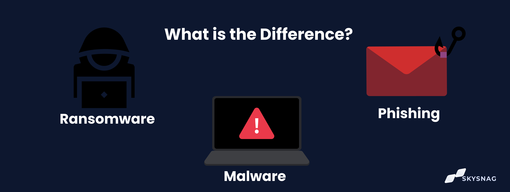

# 1. Fundamentos de la Ciberseguridad: Conceptos Clave y Amenazas Actuales

La ciberseguridad es una disciplina en constante evolución que busca proteger los sistemas, redes y programas de ataques digitales. Estos ciberataques están diseñados para acceder, cambiar o destruir información sensible; extorsionar dinero a los usuarios; o interrumpir los procesos normales del negocio [1]. En el contexto educativo y militar, la comprensión de estos fundamentos es vital para salvaguardar la información institucional y personal.

*Imagen: Infografía de la Tríada CIA en Ciberseguridad - Explicación detallada de los tres pilares fundamentales*

## 1.1. Conceptos Clave de la Ciberseguridad

La ciberseguridad se asienta sobre tres pilares fundamentales, conocidos como la Tríada CIA:

**Confidencialidad:** Garantiza que la información solo sea accesible por aquellos individuos o sistemas autorizados. Esto implica proteger los datos contra el acceso no autorizado, la divulgación o la intercepción. Por ejemplo, las calificaciones de los alumnos o los datos personales de los docentes deben ser confidenciales.

*Imagen: Modelo CIAS extendido - Visualización completa de los principios de seguridad de la información*

**Integridad:** Asegura la exactitud y completitud de la información y sus métodos de procesamiento. La información debe ser protegida contra modificaciones no autorizadas, ya sean intencionales o accidentales. Un ejemplo sería evitar que un atacante altere los resultados de un examen o la información de un expediente.

**Disponibilidad:** Garantiza que los usuarios autorizados tengan acceso a la información y a los activos relacionados cuando lo requieran. Esto implica proteger los sistemas y datos contra interrupciones o denegaciones de servicio. La plataforma virtual de aprendizaje debe estar siempre disponible para los estudiantes y docentes.

Además de la Tríada CIA, otros conceptos importantes incluyen:

*Imagen: Diferencias entre Autenticación y Autorización - Conceptos fundamentales de control de acceso*

**Autenticación:** Proceso de verificar la identidad de un usuario, dispositivo o sistema. (Ej: nombre de usuario y contraseña).

**Autorización:** Proceso de determinar qué recursos puede acceder un usuario o sistema una vez autenticado.

**No Repudio:** Garantiza que una parte no pueda negar la validez de una acción o comunicación que ha realizado.

**Vulnerabilidad:** Una debilidad en un sistema, diseño o implementación que podría ser explotada por una amenaza.

**Amenaza:** Cualquier circunstancia o evento con el potencial de causar daño a un sistema o información.

**Riesgo:** La probabilidad de que una amenaza explote una vulnerabilidad y el impacto resultante.

*Imagen: Framework AAA - Los pilares del control de acceso seguro en sistemas informáticos*

## 1.2. Amenazas Comunes y Vectores de Ataque Actuales

El panorama de amenazas cibernéticas es dinámico y complejo. Los atacantes utilizan diversas técnicas para comprometer la seguridad. Algunas de las amenazas y vectores de ataque más comunes incluyen:

**Malware:** Software malicioso diseñado para dañar, interrumpir o acceder a sistemas informáticos sin el consentimiento del usuario. Incluye:
- Virus: Se adjuntan a programas legítimos y se propagan cuando el programa se ejecuta.
- Gusanos: Programas que se replican a sí mismos y se propagan a través de redes sin necesidad de un programa anfitrión.
- Troyanos: Se disfrazan de software legítimo para engañar a los usuarios y ejecutar acciones maliciosas.
- Ransomware: Cifra los archivos de la víctima y exige un rescate para restaurar el acceso. (Como la simulación que hemos desarrollado).
- Spyware: Recopila información sobre el usuario sin su conocimiento.

*Imagen: Guía de prevención gratuita - Diferencias entre Ransomware, Malware y Phishing*

**Phishing:** Un tipo de ataque de ingeniería social donde los atacantes se hacen pasar por entidades confiables para engañar a las víctimas y obtener información sensible como nombres de usuario, contraseñas y detalles de tarjetas de crédito [2]. Se realiza comúnmente a través de correos electrónicos, pero también puede ocurrir por SMS (smishing) o llamadas telefónicas (vishing).

**Ingeniería Social:** Manipulación psicológica de personas para que realicen acciones o divulguen información confidencial. Es el vector de ataque más común, ya que explota la confianza y la falta de conocimiento de los usuarios.

*Imagen: Infografía comparativa - ¿Cuál es la diferencia entre Ransomware, Malware y Phishing?*

**Ataques de Denegación de Servicio (DoS/DDoS):** Intentos de hacer que un servicio en línea no esté disponible al sobrecargar el servidor con tráfico de internet. En el ámbito educativo, esto podría interrumpir el acceso a plataformas de aprendizaje.

**Ataques de Contraseña:** Intentos de adivinar o descifrar contraseñas, incluyendo ataques de fuerza bruta (probar todas las combinaciones posibles) y ataques de diccionario (usar listas de palabras comunes).

**Vulnerabilidades de Software:** Fallos o debilidades en el código de software que pueden ser explotados por atacantes. Es crucial mantener todos los sistemas y aplicaciones actualizados con los últimos parches de seguridad.

**Amenazas Persistentes Avanzadas (APT):** Ataques sofisticados y prolongados donde un atacante obtiene acceso a una red y permanece sin ser detectado durante un período extendido para robar datos.

*Imagen: Las 10 principales amenazas de ciberseguridad - Actualización 2025 de ConnectWise*

La comprensión de estas amenazas y cómo operan es el primer paso para desarrollar una postura de ciberseguridad robusta, tanto a nivel individual como organizacional.

---

## Referencias

[1] IBM. (2024). What is cybersecurity?. Recuperado de https://www.ibm.com/topics/cybersecurity

[2] Anti-Phishing Working Group (APWG). (2024). Phishing Activity Trends Report, 1st Quarter 2024. Recuperado de https://apwg.org/trends/

---

[← Volver al Índice](../README.md) | [Siguiente: Grooming y Redes Sociales →](02-grooming-redes-sociales.md)

