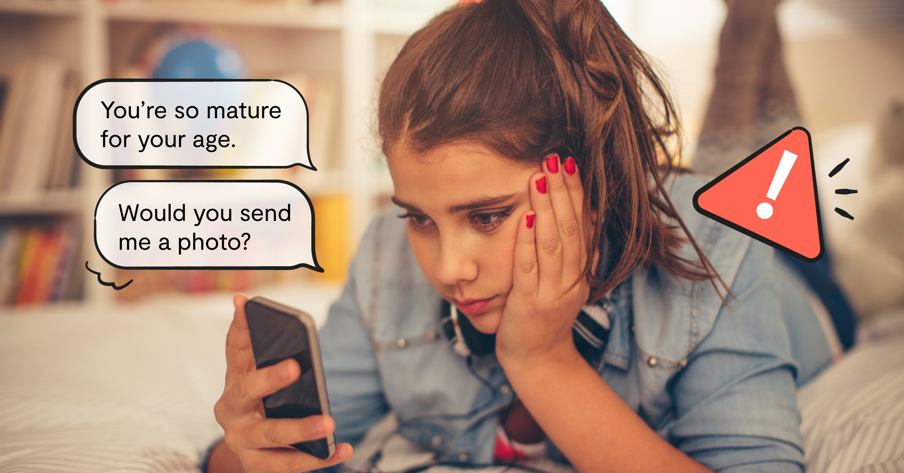
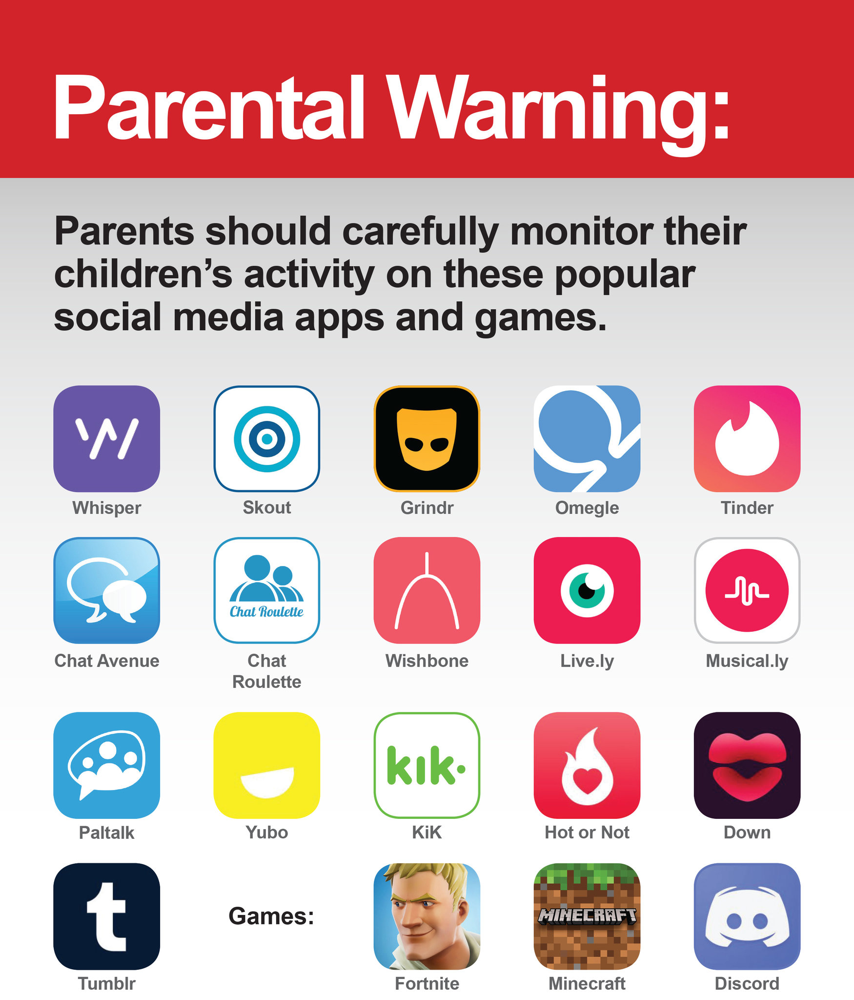
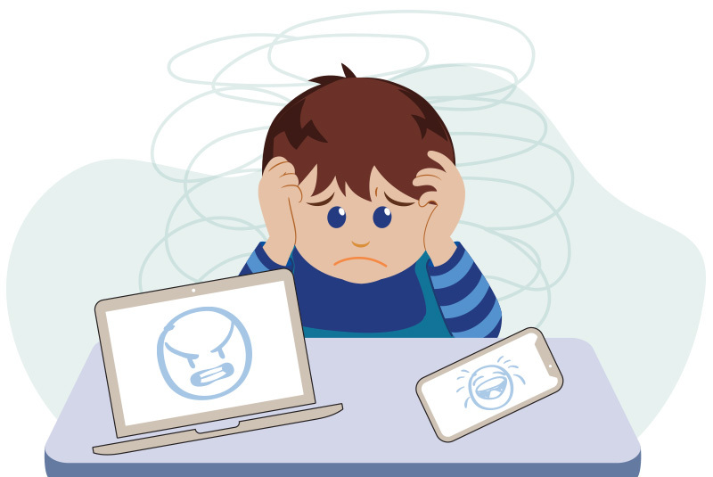
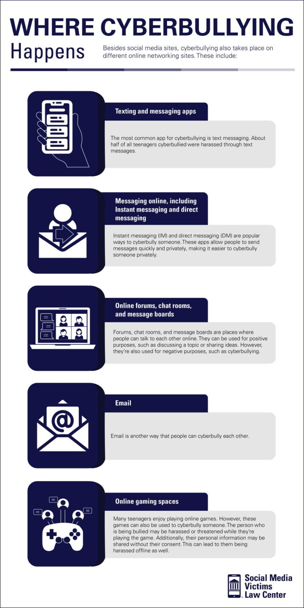
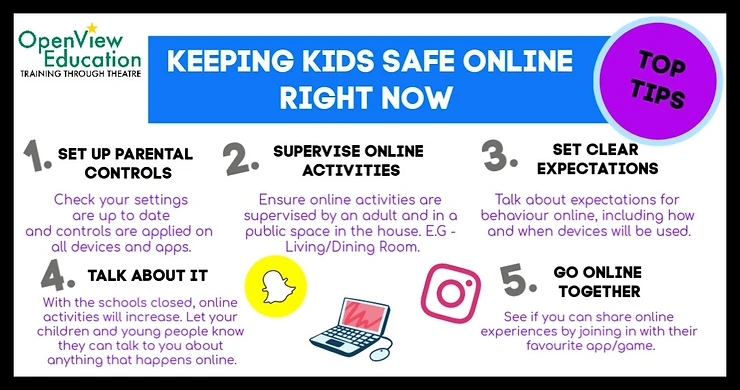

# 2. Grooming, Redes Sociales y Protección de Menores

El uso generalizado de las redes sociales ha transformado la forma en que las personas se comunican e interactúan, incluyendo a niños, niñas y adolescentes. Si bien ofrecen oportunidades para la conexión y el aprendizaje, también exponen a los menores a riesgos significativos, siendo el grooming una de las amenazas más graves. El grooming es una forma de abuso sexual infantil que ocurre en línea, donde un adulto se gana la confianza de un menor con el fin de manipularlo para un encuentro sexual o para la producción de material de abuso sexual infantil [3].

*Imagen: Cómo proteger a tus hijos de los depredadores online - Guía de seguridad digital para menores*

## 2.1. ¿Qué es el Grooming?

El grooming es un proceso gradual y manipulador que implica varias etapas:

1. **Establecimiento de Contacto:** El agresor inicia el contacto con el menor, a menudo a través de plataformas de juegos en línea, redes sociales o foros, presentándose como alguien de la misma edad o con intereses similares.

2. **Construcción de Confianza:** El agresor invierte tiempo en construir una relación de confianza con el menor, mostrándose comprensivo, amable y ofreciendo apoyo emocional o regalos virtuales.

3. **Aislamiento:** El agresor intenta aislar al menor de sus padres, amigos y otros adultos de confianza, animándolo a mantener la relación en secreto.

4. **Normalización del Comportamiento:** El agresor introduce gradualmente temas de conversación de naturaleza sexual, o solicita el envío de fotos o videos, normalizando este tipo de interacciones.

5. **Encuentro o Abuso:** Una vez que el menor ha sido manipulado y aislado, el agresor puede intentar un encuentro físico o presionar para la producción de material de abuso sexual infantil.

*Imagen: Advertencia parental - Los padres deben monitorear cuidadosamente la actividad de sus hijos en aplicaciones populares de redes sociales y juegos*

## 2.2. Riesgos en Redes Sociales para Menores

Las redes sociales, si no se utilizan de forma segura, pueden exponer a los menores a diversos riesgos:

**Exposición a Contenido Inapropiado:** Acceso a material violento, sexualmente explícito o que promueve conductas de riesgo.

**Ciberacoso (Cyberbullying):** Acoso, intimidación o humillación a través de medios digitales, con graves consecuencias emocionales y psicológicas.

**Suplantación de Identidad:** Creación de perfiles falsos o robo de identidad para engañar o dañar a los menores.

**Pérdida de Privacidad:** Compartir demasiada información personal (ubicación, datos de contacto, rutinas) que puede ser utilizada por depredadores.

**Adicción y Uso Excesivo:** El uso desmedido de redes sociales puede afectar el rendimiento académico, el sueño y las relaciones interpersonales.

*Imagen: Niños y Grooming/Depredadores Online - Centro de Prevención del Crimen Infantil y Seguridad*

## 2.3. Señales de Alerta y Prevención

Es fundamental que padres, docentes y tutores estén atentos a las señales de alerta que puedan indicar que un menor está siendo víctima de grooming o ciberacoso:

**Cambios de Comportamiento:** Retraimiento, irritabilidad, ansiedad, depresión, cambios en los patrones de sueño o alimentación.

**Uso Secreto de Dispositivos:** El menor se vuelve excesivamente protector con sus dispositivos, los usa a escondidas o borra el historial de navegación.

**Nuevos Amigos en Línea:** El menor pasa mucho tiempo interactuando con nuevos "amigos" en línea que los adultos no conocen.

**Regalos Inesperados:** Recibir regalos o dinero de personas desconocidas en línea.

**Evitación de Temas:** El menor evita hablar sobre sus actividades en línea o se muestra incómodo al respecto.

*Imagen: Ciberacoso en la era de COVID-19 - Cómo proteger a tu hijo durante el aprendizaje remoto*

## 2.4. Estrategias de Prevención y Protección

La protección de menores en el entorno digital requiere un enfoque integral que involucre a la familia, la escuela y la sociedad:

**Comunicación Abierta:** Fomentar un diálogo constante y de confianza con los menores sobre sus actividades en línea, los riesgos y cómo actuar ante situaciones incómodas.

**Educación Digital:** Enseñar a los menores sobre la privacidad en línea, la importancia de no compartir información personal con extraños, y cómo identificar y reportar contenido o interacciones inapropiadas.

**Configuración de Privacidad:** Ayudar a los menores a configurar adecuadamente la privacidad de sus perfiles en redes sociales y otras plataformas, limitando quién puede ver su información y contactarlos.

**Supervisión Parental:** Utilizar herramientas de control parental (discutidas en la siguiente sección) y supervisar de forma responsable el uso de dispositivos y el acceso a internet, sin invadir la privacidad.

**Establecer Límites:** Definir reglas claras sobre el tiempo de uso de pantallas, las plataformas permitidas y el tipo de contenido al que pueden acceder.

*Imagen: Ciberacoso - Tipos, efectos y consejos para padres - Centro Legal para Víctimas de Redes Sociales*

**Reportar y Bloquear:** Enseñar a los menores a bloquear a usuarios sospechosos y a reportar cualquier incidente de grooming o ciberacoso a las autoridades competentes (ej. fiscalías especializadas, unidades de delitos informáticos) y a las plataformas.

**Fomentar Actividades Offline:** Promover actividades fuera de línea para equilibrar el tiempo de pantalla y desarrollar habilidades sociales en el mundo real.

*Imagen: Cómo mantener a los niños seguros online durante la educación en casa - Guía de seguridad digital*

La prevención del grooming y la protección de menores en redes sociales es una responsabilidad compartida que requiere la colaboración activa de todos los actores involucrados en la vida de los niños, niñas y adolescentes.

---

## Referencias

[3] UNICEF. (2024). Ciberacoso: qué es y cómo detenerlo. Recuperado de https://www.unicef.org/es/ciberacoso-que-es-y-como-detenerlo

---

[← Anterior: Fundamentos de Ciberseguridad](01-fundamentos-ciberseguridad.md) | [Siguiente: Ciberseguridad Infantil →](03-ciberseguridad-infantil.md)

