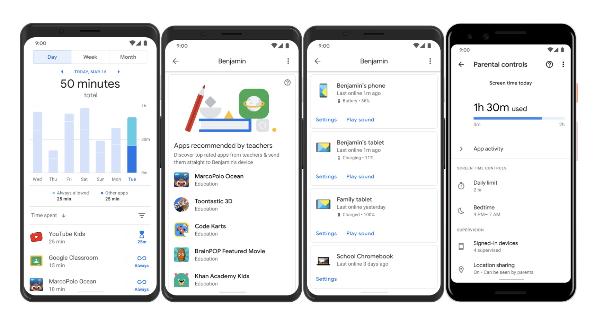
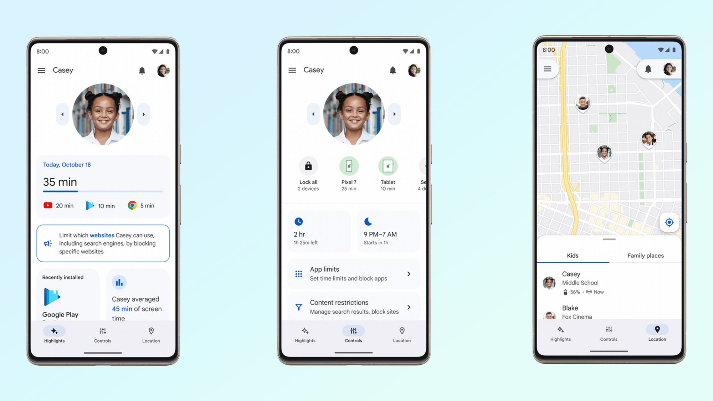
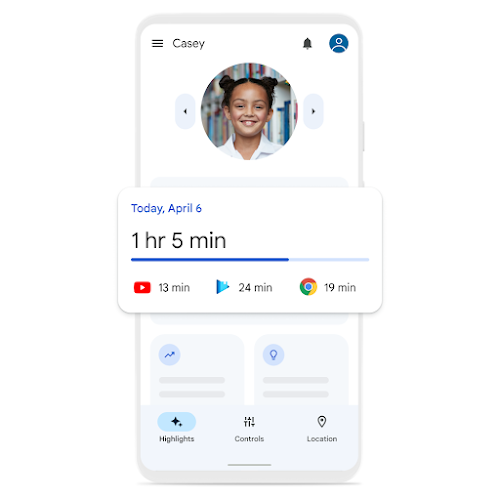
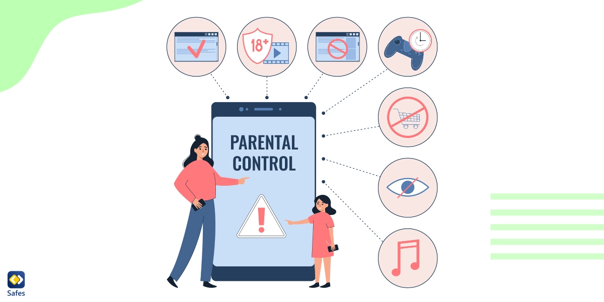

# 3. Ciberseguridad Infantil y Herramientas de Control Parental

La creciente digitalización de la vida cotidiana ha integrado a los niños en el mundo en línea desde edades tempranas. Si bien esto ofrece oportunidades educativas y de entretenimiento, también los expone a riesgos significativos. La ciberseguridad infantil se enfoca en proteger a los menores de edad de los peligros en línea, y las herramientas de control parental son un componente clave en esta estrategia [4].

*Imagen: Las actualizaciones de Google Family Link reflejan el impacto de la pandemia en el control parental digital*

## 3.1. Riesgos Específicos para Niños en Línea

Además del grooming y el ciberacoso, los niños pueden enfrentarse a otros riesgos en el entorno digital:

**Contenido Inapropiado:** Exposición accidental o intencional a contenido violento, sexualmente explícito, o que promueve conductas peligrosas (autolesiones, trastornos alimenticios).

**Contactos Peligrosos:** Interacción con extraños que pueden tener intenciones maliciosas, más allá del grooming.

**Exposición a Publicidad Engañosa:** Publicidad dirigida a niños que puede ser engañosa o promover productos y servicios inapropiados.

**Robo de Identidad:** Los datos personales de los niños pueden ser objetivo de robo para fines fraudulentos.

**Ciberadicción:** Uso excesivo de dispositivos y plataformas que puede llevar a problemas de salud física y mental, así como afectar el rendimiento académico y las relaciones sociales.

**Configuraciones de Privacidad Deficientes:** Los niños pueden no comprender la importancia de la privacidad y compartir demasiada información personal sin darse cuenta.

*Imagen: Google Family Link recibe un rediseño y nuevos controles parentales - Guía de Tom's Guide*

## 3.2. Herramientas de Control Parental

Las herramientas de control parental son aplicaciones o funciones integradas en dispositivos y plataformas que permiten a los padres o tutores gestionar y supervisar el uso que los menores hacen de la tecnología. Estas herramientas no reemplazan la comunicación y la educación, pero son un complemento útil para crear un entorno digital más seguro.

### Tipos de Herramientas de Control Parental:

**Filtros de Contenido:** Bloquean el acceso a sitios web o aplicaciones con contenido inapropiado (violencia, pornografía, juegos de azar). Pueden configurarse a nivel de router, sistema operativo o aplicación.

**Gestión de Tiempo de Pantalla:** Permiten establecer límites de tiempo para el uso de dispositivos o aplicaciones, programar horarios de uso y bloquear el acceso durante ciertas horas (ej. durante el horario escolar o de sueño).

*Imagen: Configurar controles parentales con Family Link - Centro de Seguridad de Google*

**Monitoreo de Actividad:** Ofrecen informes sobre las aplicaciones utilizadas, los sitios web visitados, el historial de búsqueda y, en algunos casos, la actividad en redes sociales. Es crucial utilizar estas funciones de manera ética y transparente con los menores.

**Control de Aplicaciones:** Permiten aprobar o bloquear la descarga e instalación de nuevas aplicaciones, así como restringir las compras dentro de las aplicaciones.

**Localización Geográfica:** Algunas herramientas permiten conocer la ubicación física del dispositivo del menor, lo que puede ser útil para su seguridad en el mundo real.

**Bloqueo de Comunicaciones:** Posibilidad de bloquear números de teléfono o contactos no deseados, o restringir la comunicación a una lista de contactos aprobados.

### Ejemplos de Herramientas Populares:

**Google Family Link:** Para dispositivos Android y Chromebooks, permite gestionar el tiempo de pantalla, aprobar aplicaciones, ver la ubicación y más.

**Apple Screen Time:** Integrado en iOS y macOS, ofrece funciones similares para dispositivos Apple.

**Microsoft Family Safety:** Para dispositivos Windows, Xbox y Android, con control de tiempo de pantalla, filtros web y de aplicaciones.

**Software de Seguridad Integral:** Muchas suites de seguridad (Norton Family, Kaspersky Safe Kids) incluyen funciones avanzadas de control parental.

**Controles de Router:** Algunos routers permiten configurar filtros de contenido y horarios de acceso a internet para todos los dispositivos conectados a la red doméstica.

*Imagen: 7 características para mejorar la seguridad infantil mientras están online - Aplicación de Control Parental Safes*

## 3.3. Políticas de Uso Seguro para Padres y Docentes

La implementación de herramientas de control parental debe ir acompañada de políticas claras y una comunicación efectiva:

**Diálogo Abierto:** Explicar a los niños por qué se utilizan estas herramientas, fomentando la confianza y la comprensión en lugar de la sensación de vigilancia.

**Establecer Reglas Claras:** Definir conjuntamente con los menores las reglas de uso de la tecnología, incluyendo horarios, contenido permitido y consecuencias del incumplimiento.

**Ser un Modelo a Seguir:** Los adultos deben predicar con el ejemplo, demostrando un uso responsable y equilibrado de la tecnología.

**Revisión Periódica:** Las configuraciones de control parental deben revisarse y ajustarse a medida que los niños crecen y sus necesidades cambian.

**Educación Continua:** Tanto padres como docentes deben mantenerse informados sobre las nuevas tecnologías, plataformas y riesgos emergentes para poder guiar adecuadamente a los menores.

**Colaboración Escuela-Familia:** Fomentar la comunicación entre la escuela y las familias para abordar de manera conjunta los desafíos de la ciberseguridad infantil y compartir mejores prácticas.

Las herramientas de control parental son un recurso valioso, pero su efectividad radica en su uso consciente y en el marco de una estrategia educativa integral que empodere a los niños para navegar de forma segura y responsable en el mundo digital.

---

## Referencias

[4] INCIBE. (2021). Guía de ciberseguridad para familias. Recuperado de https://www.incibe.es/ciudadania/concienciate/guias/guia-ciberseguridad-familias

---

[← Anterior: Grooming y Redes Sociales](02-grooming-redes-sociales.md) | [Siguiente: Rol del Docente →](04-rol-del-docente.md)

