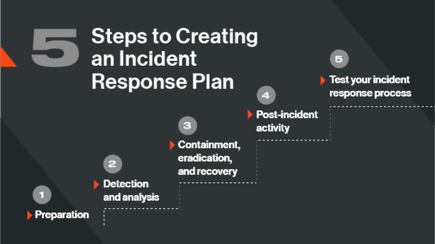
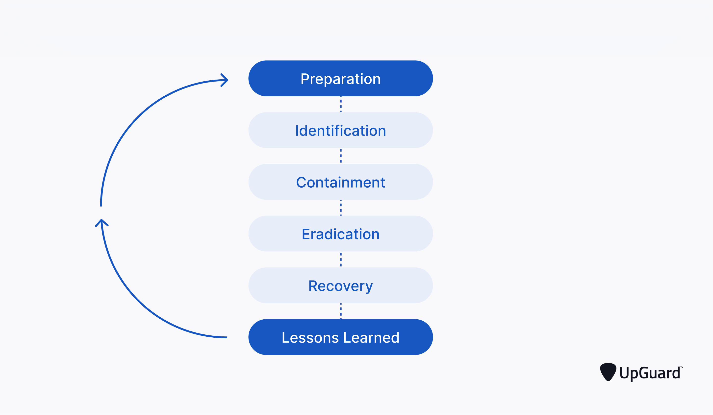

# 5. Simulación de Incidente y Creación de Plan de Protección Digital

La teoría es fundamental, pero la experiencia práctica es insustituible para desarrollar una verdadera capacidad de respuesta ante incidentes cibernéticos. Las simulaciones permiten a los participantes aplicar los conocimientos adquiridos en un entorno controlado, cometer errores sin consecuencias reales y aprender de ellos. La creación de un plan de protección digital, por su parte, traduce la teoría en acciones concretas y personalizadas [6].

*Imagen: Cómo crear un plan de respuesta a incidentes - 5 pasos básicos según BitSight Technologies*

## 5.1. Importancia de las Simulaciones de Incidentes

Las simulaciones de incidentes cibernéticos, como la que se propone en este seminario (simulación de ransomware), ofrecen múltiples beneficios:

**Aprendizaje Experiencial:** Los participantes no solo escuchan sobre un ataque, sino que lo experimentan de primera mano, lo que aumenta la retención del conocimiento y la comprensión de las consecuencias.

**Desarrollo de Habilidades Prácticas:** Permiten practicar la identificación de señales de alerta, la toma de decisiones bajo presión, la comunicación efectiva y la aplicación de protocolos de respuesta.

**Identificación de Brechas:** Revelan debilidades en los conocimientos, procedimientos o herramientas existentes, tanto a nivel individual como organizacional.

**Fomento del Trabajo en Equipo:** Requieren la colaboración entre los participantes para analizar la situación, proponer soluciones y ejecutar un plan de respuesta.

**Concientización Realista:** Demuestran la rapidez con la que un ataque puede escalar y el impacto que puede tener, reforzando la necesidad de una vigilancia constante.

*Imagen: Cómo crear un plan de respuesta a incidentes - Guía detallada de UpGuard con proceso completo*

## 5.2. Diseño de la Simulación de Ransomware

La simulación de ransomware propuesta se basa en la replicación de una página de login de la plataforma virtual de IUGNA, con un aviso sobre políticas actualizadas que, al ser aceptadas, desencadenan la pantalla de "cifrado" y la demanda de rescate.

Esta simulación está diseñada para ser:

**Realista:** La interfaz imita la plataforma real para aumentar la inmersión.

**Segura:** No se instala ningún software malicioso real ni se accede a los archivos del sistema. Es una simulación puramente visual y didáctica.

**Educativa:** Incluye mensajes claros que indican que es un ejercicio y proporciona lecciones clave al finalizar.

**Interactiva:** Requiere que el usuario realice acciones (ingresar credenciales, aceptar políticas) para que el "ataque" se active.

### Escenario de la Simulación:

1. **Acceso a la Plataforma:** Los participantes acceden a una página web que simula el login de la plataforma virtual de IUGNA.

2. **Aviso de Políticas:** Un banner o mensaje prominente informa sobre una actualización "urgente" de las políticas de privacidad, con un enlace para revisarlas y aceptarlas.

3. **Página de Políticas Fraudulenta:** Al hacer clic en el enlace, se redirige a una página que parece legítima, detallando las "nuevas políticas". Esta página incluye un checkbox para aceptar y un botón de confirmación.

4. **Activación del Ransomware:** Al hacer clic en "Confirmar Aceptación", se simula el cifrado de archivos, mostrando una pantalla de ransomware con un mensaje de advertencia, una demanda de rescate (en Bitcoin) y un contador regresivo.

5. **Desactivación y Lecciones:** Al intentar "recuperar" los archivos (haciendo clic en un botón o siguiendo una instrucción), se revela que es una simulación educativa y se presentan las lecciones clave sobre prevención y respuesta ante ransomware.

## 5.3. Creación de un Plan de Protección Digital Personal y Organizacional

Tras la experiencia de la simulación, los participantes trabajarán en la creación de un plan de protección digital. Este plan es un conjunto de acciones y medidas concretas que un individuo o una organización implementará para proteger su información y sistemas. Se fomentará la creación de planes tanto a nivel personal como, para los docentes, a nivel de su área o departamento.

### Elementos Clave de un Plan de Protección Digital:

**Evaluación de Riesgos:** Identificar qué información es valiosa, dónde se almacena y cuáles son las posibles amenazas y vulnerabilidades.

**Medidas Preventivas:** Definir acciones para reducir la probabilidad de un incidente:

- **Contraseñas Fuertes y MFA:** Implementación de políticas de contraseñas robustas y autenticación multifactor.
- **Copias de Seguridad:** Establecer una rutina de copias de seguridad regulares, verificadas y almacenadas de forma segura (regla 3-2-1: 3 copias, en 2 tipos de medios diferentes, 1 fuera de sitio).
- **Actualizaciones:** Mantener sistemas operativos, aplicaciones y software de seguridad actualizados.
- **Concientización:** Participar en programas de formación y estar alerta a las técnicas de ingeniería social.
- **Software de Seguridad:** Uso de antivirus, firewalls y otras herramientas de protección.

**Plan de Respuesta a Incidentes:** Qué hacer si ocurre un ataque:

- **Identificación:** Cómo reconocer un incidente.
- **Contención:** Pasos para limitar el daño y evitar la propagación (ej. desconectar de la red).
- **Erradicación:** Eliminar la causa raíz del incidente.
- **Recuperación:** Restaurar los sistemas y datos a su estado normal.
- **Lecciones Aprendidas:** Analizar el incidente para mejorar la seguridad futura.

**Cumplimiento Normativo:** Asegurarse de que el plan se alinee con las leyes y regulaciones de protección de datos aplicables.

**Revisión y Actualización:** Los planes de protección digital no son estáticos; deben revisarse y actualizarse periódicamente para adaptarse a las nuevas amenazas y tecnologías.

Este ejercicio práctico permitirá a los participantes traducir el conocimiento teórico en acciones concretas, empoderándolos para ser agentes activos en su propia ciberseguridad y la de su entorno.

## Conclusiones del Módulo 1

El Módulo 1 ha proporcionado una visión integral de la ciberseguridad, desde sus fundamentos y las amenazas actuales hasta la protección de los más vulnerables en el entorno digital y el rol esencial de los educadores. Se ha enfatizado la importancia de la concientización, la educación continua y la aplicación de medidas preventivas y de respuesta. La simulación de incidentes y la creación de planes de protección digital son herramientas clave para traducir el conocimiento teórico en habilidades prácticas, preparando a los participantes para enfrentar los desafíos de la ciberseguridad en su vida personal, académica y profesional. La colaboración entre todos los actores de la comunidad educativa es fundamental para construir un entorno digital seguro y resiliente.

---

## Referencias Completas

[1] IBM. (2024). What is cybersecurity?. Recuperado de https://www.ibm.com/topics/cybersecurity

[2] Anti-Phishing Working Group (APWG). (2024). Phishing Activity Trends Report, 1st Quarter 2024. Recuperado de https://apwg.org/trends/

[3] UNICEF. (2024). Ciberacoso: qué es y cómo detenerlo. Recuperado de https://www.unicef.org/es/ciberacoso-que-es-y-como-detenerlo

[4] INCIBE. (2021). Guía de ciberseguridad para familias. Recuperado de https://www.incibe.es/ciudadania/concienciate/guias/guia-ciberseguridad-familias

[5] UNESCO. (2019). Guía de ciberseguridad para docentes. Recuperado de https://unesdoc.unesco.org/ark:/48223/pf0000370607

[6] NIST. (2018). Framework for Improving Critical Infrastructure Cybersecurity (Version 1.1). Recuperado de https://www.nist.gov/cyberframework

---

[← Anterior: Rol del Docente](04-rol-del-docente.md) | [Volver al Índice](../README.md)

